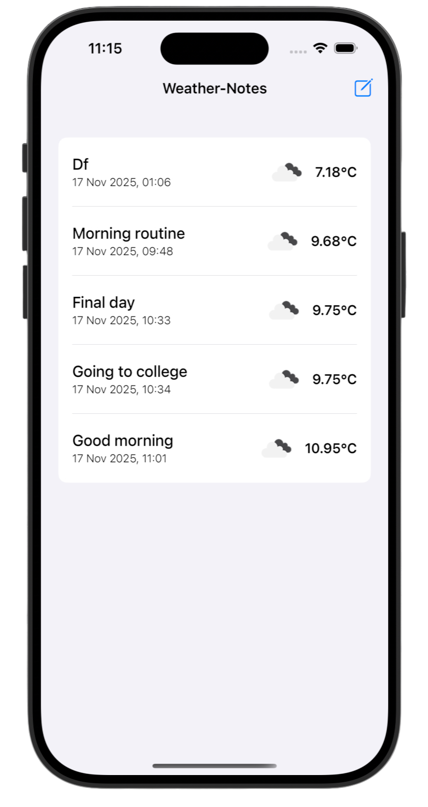
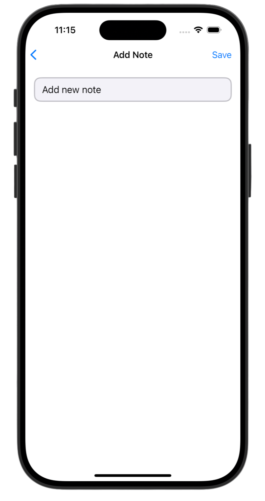
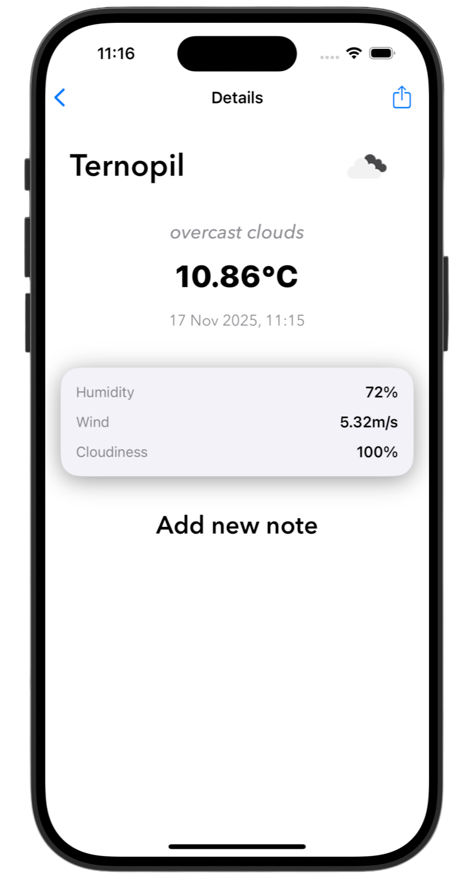

# WeatherNotes 🌤️📝

>WeatherNotes is a minimalist iOS application that allows users to create notes with automatically attached weather data. Each note captures the current weather conditions at the moment of creation, creating a weather-journal experience.

---

## Key Features ✨ 

- 📝 Smart Note Taking - Create notes with automatic weather context
- 🌤️ Real-time Weather - Integrated OpenWeather API for accurate weather data
- 💾 Local Persistence - Notes saved locally using UserDefaults
- 🎨 Clean UI - Modern interface with dark theme support
- 📊 Detailed Weather Info - Complete meteorological data display

---

## Screenshots

<div align="center">
  
  
  
</div>

---

## 🛠️ Technical Stack

<p align="center">
Swift  |  UIKit  |  MVVM  |  URLSession  |  UserDefaults
</p>

---

## 📦 Installation

1. Clone the repository:
```bash
git clone https://github.com/gurman-man/WeatherNotes.git
```
2. Open `WeatherNotes.xcodeproj` in Xcode
3. Run on the simulator or your device

